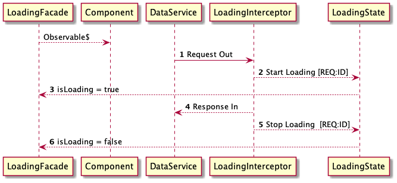

# Registry Loading Interceptor

This library provides an interceptor which maps Http Requests to a Loading State.
You're able to subscribe per request to the loading state.


## Usage
1) Import the `RegisterLoadingInterceptorModule` in your root module _(hint: most of the time: app.module.ts)_
2) Configure the `RegisterLoadingInterceptorModule` with it's `forRoot()` method.
   1) You must provide a RequestIdStrategy
   2) You must provide a RequestFilterStrategy _(default: no requests get filtered)_
3. Create your own SelectorFacade to the loading state

## Definitions

### RequestIdStrategy
Provides a mechanism to generate an ID from a request. Default ships with a URL to ID example.
Trough this Request ID you're able to create a selector to observe the loading state of a single request.


### RequestFilterStrategy
You may not want to map every request to a loading state, this is the place where you can provide a mechanism to filter/exclude request.
* _If using Angular 12, you can provide your own HttpContext based filter._

### SelectorFacade
Create a service which injects `RegistryLoadingInterceptor`and filters RequestID based on the `loadingState$`.


## Usage Example
### App Module Configuration
Root Module _(app.module.ts)_ registration and configuration
```typescript
@NgModule({
  declarations: [AppComponent],
  imports: [
    // ... other imports
    RegistryLoadingInterceptorModule.forRoot({
      // we use the module provided no request filtering which implements the
      // RequestFilterStrategy Interface.
      requestFilter: new NoRequestFiltering(),
      // we use the module provided url fragment id generator  which implements 
      // the RequestIdGeneratorStrategy. 
      requestIdGenerator: new UrlFragmentIdGenerator()
    })
  ],
  
})
export class AppModule { }
```
### Selector Facade
```typescript
@Injectable({providedIn: 'root'})
export class IsLoadingService {

  public constructor(private readonly loadingRegistry: RegistryLoadingInterceptor) {}

  /**
   * In this example we are using the UrlFragmentIdGenerator.
   * */
  public isLoading$(url: string): Observable<boolean> {
    const requestId = UrlFragmentIdGenerator.getIdentifier(url);
    return this.loadingRegistry.loadingState$.pipe(
      map(state => state.has(requestId) ? state.get(requestId) as boolean : false),
      distinctUntilChanged()
    );
  }
}
```

### DataAccess Level: Test DataAccess Example
```typescript

@Injectable({
  providedIn: 'root'
})
export class TestDataAccessService {

  private static getUsersEndpoint = '/users';

  public userListLoading$: Observable<boolean>;

  public constructor(
    private readonly httpClient: HttpClient,
    private readonly isLoadingService: IsLoadingService
    ) {
    // register request loading listener
    this.userListLoading$ = isLoadingService.isLoading$(TestDataAccessService.getUsersEndpoint);
  }

  public getUsers$(): Observable<unknown> {
    return this.httpClient.get(TestDataAccessService.getUsersEndpoint);
  }
}
```
### Component Level
```typescript
@Component({
  selector: 'app-root',
  templateUrl: './app.component.html',
  styleUrls: ['./app.component.scss']
})
export class AppComponent {

  public isLoading$: Observable<boolean>;

  public constructor(private readonly testDataAccess: TestDataAccessService) {
    // connect the facade with the view
    this.isLoading$ = testDataAccess.userListLoading$;
  }

}
```


## Data Sequence Diagram

    
